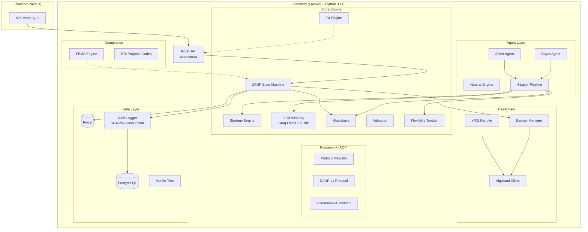

# A2A Treasury Network

### Agentic Commerce Framework (ACF) — AlgoBharat Hackathon · Problem 7

> Autonomous AI agents that negotiate trade deals and settle payments on Algorand.
> Zero human involvement from first offer to final on-chain payment.

---

## What It Does (One-liner)

Two autonomous AI agents **discover each other, negotiate a trade deal, deploy an Algorand blockchain escrow, settle payment via x402, and produce a cryptographically verifiable audit trail** — all with **zero human involvement**.

---

## The Problem (AlgoBharat Problem 7)

Indian SMEs spend **3–7 days** on manual B2B trade negotiation and settlement for every transaction. Cross-border payments add FEMA/RBI compliance overhead. There is no standard protocol for autonomous agent-to-agent commerce.

**Our solution**: An end-to-end Agentic Commerce Framework where:
- Enterprises register and are provisioned with **Agent Cards**
- AI agents **discover each other** via a registry and verify protocol compatibility
- Agents **negotiate autonomously** using a 4-layer FSM — reaching agreement in 2–3 rounds
- A **2-of-3 multisig escrow** is deployed on Algorand
- Payment settles via the **x402 HTTP payment protocol** — buyer signs an Algorand `PaymentTxn` autonomously
- A **SHA-256 hash chain + Merkle root** is anchored on-chain for verifiable audit

---

## High-Level Architecture



---

## ACF Framework Architecture

```
┌─────────────────────────────────────────────────────────────┐
│              AGENTIC COMMERCE FRAMEWORK (ACF)               │
├──────────────┬──────────────┬──────────────┬────────────────┤
│   PROTOCOL   │  SETTLEMENT  │    POLICY    │  VERIFICATION  │
│    LAYER     │    LAYER     │    LAYER     │     LAYER      │
│              │              │              │                │
│  DANP-v1     │  x402 +      │  ACF Policy  │  SHA-256 Chain │
│  FixedPrice  │  Algorand    │  Engine      │  Merkle Root   │
│  -v1         │  Testnet     │  Guardrails  │  On-chain      │
│              │              │              │  Anchor        │
├──────────────┴──────────────┴──────────────┴────────────────┤
│                    AGENT LAYER                              │
│         Buyer Agent · Neutral Engine · Seller Agent        │
├─────────────────────────────────────────────────────────────┤
│                 DISCOVERY LAYER                             │
│      Agent Registry · Capability Handshake · Agent Cards   │
└─────────────────────────────────────────────────────────────┘
```

---

## End-to-End Flow (7 Steps)

```
1. REGISTER    Two enterprises register → Agent Cards provisioned
               Agents register in ACF discovery registry
               GET /v1/agents?service=cotton&protocol=DANP-v1 → finds them

2. POLICY      Budget ceilings, compliance flags, escrow requirements loaded
               ACFPolicyEngine enforces constraints throughout lifecycle

3. HANDSHAKE   POST /v1/handshake → compatibility verified before negotiation
               Selects shared protocol (DANP-v1) and settlement (x402-algorand)

4. NEGOTIATE   DANP-v1 FSM runs autonomously
               Buyer ₹85,000 → Seller ₹95,918 → Buyer ₹90,270 → Seller ACCEPTS
               Agreement in 2–3 rounds. Zero human input.

5. ESCROW      Algorand multisig escrow deployed on testnet
               Address derived from buyer + seller public keys

6. PAYMENT     Buyer agent receives HTTP 402 challenge
               Signs Algorand PaymentTxn autonomously
               Submits X-PAYMENT header → confirmed on-chain
               tx_id stored in SHA-256 audit chain

7. AUDIT       19+ audit entries · SHA-256 hash chain VALID
               Merkle root computed · Anchored on Algorand testnet
               Every offer, guardrail, and payment cryptographically provable
```

---

## Module-by-Module Breakdown

### 1. [core/state_machine.py](file:///c:/Users/Shreyas/OneDrive/Desktop/A-TOA/a2a-treasury/core/state_machine.py) — DANP Finite State Machine (789 lines) ⭐ **Most Critical**

The **heart of the system**. Implements the full negotiation lifecycle as a finite state machine:

| State | Meaning |
|-------|---------|
| `INIT` | Session created, awaiting first move |
| `BUYER_ANCHOR` | Buyer placed opening offer, seller's turn |
| `SELLER_RESPONSE` | Seller responded, buyer's turn |
| `ROUND_LOOP` | Alternating counter-offers |
| `AGREED` ✅ | Deal struck — triggers escrow |
| `WALKAWAY` ❌ | Agent rejected the deal |
| `TIMEOUT` ⏰ | Negotiation timed out |
| `ROUND_LIMIT` | Max rounds exceeded |
| `STALLED` | No meaningful price movement for 3 rounds |
| `POLICY_BREACH` | Guardrail violation |

**Key methods:**
- [create_session()](file:///c:/Users/Shreyas/OneDrive/Desktop/A-TOA/a2a-treasury/core/state_machine.py#38-200) — validates enterprises (both must be ACTIVE), checks agent configs, validates initial offer against budget ceilings / max exposure, computes valuation snapshots for buyer + seller, writes opening offer to DB, and stores fast-access state in Redis
- [process_action()](file:///c:/Users/Shreyas/OneDrive/Desktop/A-TOA/a2a-treasury/core/state_machine.py#202-544) — **13-step validation pipeline** executed for every single agent action:
  1. Rate limit check (1 action per 2s via Redis)
  2. Load session state from Redis (with PostgreSQL rebuild fallback)
  3. Terminal state check
  4. Timeout check (with auto-transition to `TIMEOUT`)
  5. Turn order enforcement (prevents acting out of turn)
  6. Round number validation
  7. Guardrail enforcement (budget ceiling, max exposure, reservation price)
  8. Rationale sanitization (prompt injection defense)
  9. Offer persistence to DB
  10. Audit log entry (SHA-256 hash chain)
  11. FSM transition evaluation (accept → AGREED, reject → WALKAWAY, counter → next state)
  12. Write new state to both PostgreSQL and Redis
  13. Return response
- [_trigger_escrow()](file:///c:/Users/Shreyas/OneDrive/Desktop/A-TOA/a2a-treasury/core/state_machine.py#582-628) — auto-deploys Algorand escrow on AGREED
- [_auto_create_compliance()](file:///c:/Users/Shreyas/OneDrive/Desktop/A-TOA/a2a-treasury/core/state_machine.py#629-702) — auto-creates FEMA compliance record on escrow deploy

---

### 2. [core/valuation.py](file:///c:/Users/Shreyas/OneDrive/Desktop/A-TOA/a2a-treasury/core/valuation.py) — Layer 1: Deterministic Valuation Engine (166 lines)

**PURELY DETERMINISTIC MATH.** No LLM. No Redis. No DB. No randomness. No I/O of any kind. This is the **ONLY** module permitted to compute financial thresholds:

- [compute_reservation_price(intrinsic_value, risk_factor, agent_role)](file:///c:/Users/Shreyas/OneDrive/Desktop/A-TOA/a2a-treasury/core/valuation.py#16-35):
  - **Buyer**: `intrinsic_value × (1 + risk_factor)` — absolute ceiling, never offer above
  - **Seller**: `intrinsic_value × (1 - risk_factor)` — absolute floor, never accept below
- [compute_target_price(intrinsic_value, negotiation_margin, agent_role)](file:///c:/Users/Shreyas/OneDrive/Desktop/A-TOA/a2a-treasury/core/valuation.py#37-54):
  - **Buyer**: `intrinsic_value × (1 - margin)` — aspiration price (get it cheap)
  - **Seller**: `intrinsic_value × (1 + margin)` — aspiration price (sell high)
- [compute_utility_score(offer, reservation, target, role)](file:///c:/Users/Shreyas/OneDrive/Desktop/A-TOA/a2a-treasury/core/valuation.py#56-90):
  - Normalized `[0.0, 1.0]` — 1.0 at target, 0.0 at reservation
  - Buyer utility increases as price decreases; seller utility increases as price increases
- [compute_opening_anchor(target, concession_curve, role)](file:///c:/Users/Shreyas/OneDrive/Desktop/A-TOA/a2a-treasury/core/valuation.py#92-113):
  - Buyer anchors BELOW target; seller anchors ABOVE target
- [build_valuation_snapshot(agent_config)](file:///c:/Users/Shreyas/OneDrive/Desktop/A-TOA/a2a-treasury/core/valuation.py#115-151):
  - Computed **ONCE** at session creation, frozen in Redis, **NEVER** recomputed

---

### 3. [core/strategy.py](file:///c:/Users/Shreyas/OneDrive/Desktop/A-TOA/a2a-treasury/core/strategy.py) — Layer 2: Game-Theoretic Strategy Engine (218 lines)

**Deterministic** (no LLM, no I/O). Decides HOW agents move toward their target price using game theory:

- [compute_next_offer()](file:///c:/Users/Shreyas/OneDrive/Desktop/A-TOA/a2a-treasury/core/strategy.py#13-112) — **10-step calculation**:
  1. Base concession fraction from pre-configured curve per round
  2. **Tit-for-tat** bonus: +0.5% if opponent conceded >2%, -0.2% if opponent held firm (<0.5%)
  3. Flexibility modifier: adjusts based on opponent behavioral pattern
  4. **LLM modifier**: advisory signal (capped at ±1% — advisory only, never in control)
  5. Deadline pressure: 1.3x urgency multiplier in last 2 rounds
  6. Total concession fraction (clamped to `[0.1%, 15%]`)
  7. Compute offer value (buyer moves up, seller moves down)
  8. Strategy tag classification ([anchor](file:///c:/Users/Shreyas/OneDrive/Desktop/A-TOA/a2a-treasury/core/anchor_service.py#25-163), `hold`, `concede`, `deadline_push`)
  9. Confidence score (distance from target as ratio of range)
  10. Round to 2 decimal places
- [should_accept()](file:///c:/Users/Shreyas/OneDrive/Desktop/A-TOA/a2a-treasury/core/strategy.py#114-157) — returns `True` if:
  - Opponent offer within 0.5% of target price
  - Last round AND offer within guardrail bounds
  - Utility ≥ 0.85
  - Cooperative opponent (flexibility > 0.7) AND utility ≥ 0.70
- [should_reject()](file:///c:/Users/Shreyas/OneDrive/Desktop/A-TOA/a2a-treasury/core/strategy.py#193-218) — hard WALKAWAY if opponent exceeds guardrails by >5%
- [compute_opening_offer()](file:///c:/Users/Shreyas/OneDrive/Desktop/A-TOA/a2a-treasury/core/strategy.py#159-191) — first offer from valuation snapshot opening anchor

---

### 4. [core/llm_reasoning.py](file:///c:/Users/Shreyas/OneDrive/Desktop/A-TOA/a2a-treasury/core/llm_reasoning.py) — Layer 3: LLM Advisory (253 lines)

**ADVISORY ONLY.** Output is a modifier signal. The LLM is **NEVER** in control. Critical security properties:

- **Never sees** reservation price, budget ceiling, or any financial threshold — analyzes only behavioral patterns (percentage changes between offers)
- **Output schema-validated** — must return valid JSON matching exact Pydantic model
- **Modifier capped** at ±0.5 (strategy layer further caps to ±1%)
- **Circuit breaker** — after 3 consecutive failures, LLM is disabled for that session
- **Fallback** — `DEFAULT_ADVISORY` with modifier 0.0 (no influence) on any failure

Uses **Groq API** with `llama-3.3-70b-versatile` model (`temperature=0.3`, `max_tokens=256`, `response_format=json_object`). Classifies opponent as:

| Type | Meaning | Modifier |
|------|---------|----------|
| `aggressive` | Holding firm, minimal concessions | Negative (hold firmer) |
| `cooperative` | Large concessions, willing to deal | Positive (concede more) |
| `strategic` | Calculated, rational | ~0.0 (no adjustment) |
| `bluffing` | Position inconsistent with pattern | Negative (call bluff) |

---

### 5. [core/guardrails.py](file:///c:/Users/Shreyas/OneDrive/Desktop/A-TOA/a2a-treasury/core/guardrails.py) — Layer 4: Hard Veto Authority (199 lines)

**ABSOLUTE VETO AUTHORITY.** Runs LAST after all other layers. Cannot be overridden by any LLM output, strategy decision, or any other layer.

**6 hard rules** checked in sequence — BLOCKED on first failure:

| Rule | Trigger |
|------|---------|
| `RESERVATION_BREACH` | Seller counter below reservation floor |
| `BUDGET_CEILING_BREACH` | Buyer counter above budget ceiling |
| `MAX_EXPOSURE_BREACH` | Any counter above max exposure |
| `ACCEPT_BELOW_FLOOR` | Seller accepting below reservation |
| `ACCEPT_ABOVE_CEILING` | Buyer accepting above ceiling |
| `INVALID_OFFER_VALUE` | Negative or zero offer |

On BLOCKED:
1. Persists to `guardrail_logs` table
2. Increments failure count in Redis
3. If ≥3 consecutive failures → escalates to `POLICY_BREACH` (terminal state)

---

### 6. [core/flexibility_tracker.py](file:///c:/Users/Shreyas/OneDrive/Desktop/A-TOA/a2a-treasury/core/flexibility_tracker.py) — Opponent Behavioral Metrics (132 lines)

Tracks real-time opponent concession patterns per session in Redis:

- **Rolling flexibility score** — `old_flexibility × 0.7 + new_flexibility × 0.3` (exponential moving average)
- **Concession rate** — average absolute price change per round
- **Response time tracking** — average response time history
- **Pattern detection**: `cooperative` (>0.7), `aggressive` (<0.2), `strategic` (fast response), `stalling` (slow)
- Stored at `flexibility:{session_id}:{observing_role}` with 1-hour TTL

---

### 7. [agents/pipeline.py](file:///c:/Users/Shreyas/OneDrive/Desktop/A-TOA/a2a-treasury/agents/pipeline.py) — 4-Layer Agent Turn Pipeline (274 lines)

Shared by both [BuyerAgent](file:///c:/Users/Shreyas/OneDrive/Desktop/A-TOA/a2a-treasury/agents/buyer_agent.py#21-78) and [SellerAgent](file:///c:/Users/Shreyas/OneDrive/Desktop/A-TOA/a2a-treasury/agents/seller_agent.py#21-78). Each turn flows through **all 4 layers** sequentially:

| Layer | Component | Role |
|-------|-----------|------|
| Layer 1 | [valuation.py](file:///c:/Users/Shreyas/OneDrive/Desktop/A-TOA/a2a-treasury/core/valuation.py) | Frozen price boundaries (reservation, target, opening anchor) |
| Layer 2 | [strategy.py](file:///c:/Users/Shreyas/OneDrive/Desktop/A-TOA/a2a-treasury/core/strategy.py) | Deterministic strategy decision (accept/reject/counter + value) |
| Layer 3 | [llm_reasoning.py](file:///c:/Users/Shreyas/OneDrive/Desktop/A-TOA/a2a-treasury/core/llm_reasoning.py) | LLM classifies opponent style → suggests modifier (advisory only) |
| Layer 4 | [guardrails.py](file:///c:/Users/Shreyas/OneDrive/Desktop/A-TOA/a2a-treasury/core/guardrails.py) | Budget ceiling enforcement, policy breach detection |

After all 4 layers, the action is wrapped in an envelope and routed via the **A2A Task Manager** → state machine → audit log.

---

### 8. [agents/buyer_agent.py](file:///c:/Users/Shreyas/OneDrive/Desktop/A-TOA/a2a-treasury/agents/buyer_agent.py) & [agents/seller_agent.py](file:///c:/Users/Shreyas/OneDrive/Desktop/A-TOA/a2a-treasury/agents/seller_agent.py) (~78 lines each)

Autonomous polling agents. Each:
- Polls Redis session state every **1 second**
- When it's their turn (`expected_turn == "buyer"/"seller"`), calls [run_agent_turn()](file:///c:/Users/Shreyas/OneDrive/Desktop/A-TOA/a2a-treasury/agents/pipeline.py#80-274)
- Respects rate limiting (backs off 3s on 429 responses)
- Sleeps 2.5s after each successful action
- Stops when session reaches a terminal state
- **Never imports from the other agent** — shares logic only via [pipeline.py](file:///c:/Users/Shreyas/OneDrive/Desktop/A-TOA/a2a-treasury/agents/pipeline.py)

---

### 9. [agents/neutral_agent.py](file:///c:/Users/Shreyas/OneDrive/Desktop/A-TOA/a2a-treasury/agents/neutral_agent.py) — Neutral Protocol Engine (295 lines)

**Zero financial position. Pure routing.** Orchestrates the complete autonomous negotiation:

- Runs buyer/seller turns **sequentially** in a loop (not concurrent)
- Reads [expected_turn](file:///c:/Users/Shreyas/OneDrive/Desktop/A-TOA/a2a-treasury/core/state_machine.py#704-723) from Redis state to determine whose turn it is
- Retries agent config lookup up to 3 times (handles timing races)
- On fatal config failure → transitions to `WALKAWAY` instead of hanging
- Detects `POLICY_BREACH` from guardrail exceptions → transitions to terminal
- Safety limit: **50 iterations maximum**
- After terminal state:
  1. Triggers escrow (if AGREED)
  2. Computes **Merkle root** from all session audit entries
  3. **Anchors Merkle root** on Algorand testnet (if ANCHOR_ENABLED)
  4. Logs `A2A_NEGOTIATION_COMPLETE`

---

### 10. [agents/multi_party_session.py](file:///c:/Users/Shreyas/OneDrive/Desktop/A-TOA/a2a-treasury/agents/multi_party_session.py) — Multi-Party Negotiation Coordinator (339 lines)

Allows **ONE buyer** to negotiate with **MULTIPLE sellers** simultaneously (2–5 sellers):

- [create_multi_session()](file:///c:/Users/Shreyas/OneDrive/Desktop/A-TOA/a2a-treasury/agents/multi_party_session.py#29-107) — creates one child DANP session per seller
- [run_multi_session()](file:///c:/Users/Shreyas/OneDrive/Desktop/A-TOA/a2a-treasury/agents/multi_party_session.py#108-242) — runs all child sessions concurrently via `asyncio.gather`
- **Winner selection**: lowest AGREED value (best price for buyer)
- **RULE 19**: Escrow triggered for winning session ONLY; all losers terminated as `WALKAWAY` with outcome `MULTI_PARTY_LOSER`
- [get_leaderboard()](file:///c:/Users/Shreyas/OneDrive/Desktop/A-TOA/a2a-treasury/agents/multi_party_session.py#284-335) — ranked list of offers across all child sessions

---

### 11. [core/fx_engine.py](file:///c:/Users/Shreyas/OneDrive/Desktop/A-TOA/a2a-treasury/core/fx_engine.py) — FX Rate Engine (277 lines)

Live INR↔USDC conversion using the free [Frankfurter API](https://api.frankfurter.app):

- **Rate fetching** — `GET /latest?from=USD&to=INR` → `mid_rate = 1/INR_per_USD`
- **Rate locking** — FX rate is frozen at session creation (**Rule 17**: never changes mid-session)
- **Buy/sell spread** — configurable (default 25 basis points)
- **Redis caching** — 5-minute TTL to reduce API calls
- **DB persistence** — all quotes stored in `fx_quotes` table with session association
- **Fallback** — uses fixed rate (0.01193 USDC/INR) if API fails
- [convert_inr_to_usdc()](file:///c:/Users/Shreyas/OneDrive/Desktop/A-TOA/a2a-treasury/core/fx_engine.py#217-232) / [convert_usdc_to_inr()](file:///c:/Users/Shreyas/OneDrive/Desktop/A-TOA/a2a-treasury/core/fx_engine.py#233-247) — uses locked sell/buy rates

---

### 12. [blockchain/escrow_manager.py](file:///c:/Users/Shreyas/OneDrive/Desktop/A-TOA/a2a-treasury/blockchain/escrow_manager.py) — Algorand Escrow (603 lines)

Manages the full escrow lifecycle on Algorand:

| Method | What It Does |
|--------|-------------|
| [trigger_escrow()](file:///c:/Users/Shreyas/OneDrive/Desktop/A-TOA/a2a-treasury/blockchain/escrow_manager.py#467-599) | Auto-called on AGREED; loads wallets, generates payload, deploys escrow. Idempotent. |
| [generate_escrow_payload()](file:///c:/Users/Shreyas/OneDrive/Desktop/A-TOA/a2a-treasury/blockchain/escrow_manager.py#55-80) | Converts agreed INR amount to USDC micro-units |
| [create_multisig_escrow()](file:///c:/Users/Shreyas/OneDrive/Desktop/A-TOA/a2a-treasury/blockchain/escrow_manager.py#81-141) | Creates 2-of-3 multisig address (buyer + seller + platform) |
| [deploy_escrow()](file:///c:/Users/Shreyas/OneDrive/Desktop/A-TOA/a2a-treasury/blockchain/escrow_manager.py#142-162) | Dry-run simulation before any broadcast |
| [fund_escrow()](file:///c:/Users/Shreyas/OneDrive/Desktop/A-TOA/a2a-treasury/blockchain/escrow_manager.py#163-248) | Transfers USDC from buyer to escrow (**idempotent** — returns existing if already FUNDED) |
| [release_escrow()](file:///c:/Users/Shreyas/OneDrive/Desktop/A-TOA/a2a-treasury/blockchain/escrow_manager.py#249-390) | Releases USDC from escrow to seller (requires FUNDED status) |
| [refund_escrow()](file:///c:/Users/Shreyas/OneDrive/Desktop/A-TOA/a2a-treasury/blockchain/escrow_manager.py#391-466) | Returns USDC to buyer (dispute resolution) |

**Dual mode:** simulation (deterministic `SIM-` prefixed fake addresses) or LIVE (real Algorand testnet transactions using USDC asset transfers).

---

### 13. [core/x402_handler.py](file:///c:/Users/Shreyas/OneDrive/Desktop/A-TOA/a2a-treasury/core/x402_handler.py) — HTTP Payment Protocol (338 lines)

Implements the [x402](https://x402.org) payment protocol for autonomous agent payments:

```
┌───────────┐     402 + body     ┌───────────┐
│  Seller   │ ──────────────────>│  Buyer    │
│  Server   │                    │  Agent    │
│           │  X-PAYMENT header  │           │
│           │ <──────────────────│           │
│           │  200 OK            │           │
│           │ ──────────────────>│           │
└───────────┘                    └───────────┘
```

- [build_402_response(session_id, amount_usdc, escrow_address, ...)](file:///c:/Users/Shreyas/OneDrive/Desktop/A-TOA/a2a-treasury/core/x402_handler.py#84-125) — seller side: generates HTTP 402 challenge body with x402 schema
- [sign_payment_algorand(payment_requirements, ...)](file:///c:/Users/Shreyas/OneDrive/Desktop/A-TOA/a2a-treasury/core/x402_handler.py#130-196) — buyer side: signs Algorand `PaymentTxn` with wallet mnemonic, adds nonce for tx uniqueness
- [verify_and_submit_payment(x_payment_header, ...)](file:///c:/Users/Shreyas/OneDrive/Desktop/A-TOA/a2a-treasury/core/x402_handler.py#201-318) — server middleware: decodes base64 signed txn, broadcasts via `send_raw_transaction`, waits for confirmation (up to 10 rounds ≈ 30s)

On-chain amounts are **demo-capped** (default 0.01 ALGO = 10,000 microAlgos) to keep testnet usage cheap.

---

### 14. [compliance/fema_engine.py](file:///c:/Users/Shreyas/OneDrive/Desktop/A-TOA/a2a-treasury/compliance/fema_engine.py) — FEMA/RBI Compliance (264 lines)

India's Foreign Exchange Management Act compliance for cross-border payments:

- Classifies transactions as **DOMESTIC** (exempt), **ODI** (outward direct investment), or **FDI** (foreign direct investment)
- Enforces limits: ODI per-transaction **$250K**, FDI **$500K**
- Two modes: **strict** (blocks non-compliant) or **default** (warnings only, never blocks)
- Auto-records compliance for every session

#### 11 RBI Purpose Codes ([rbi_codes.py](file:///c:/Users/Shreyas/OneDrive/Desktop/A-TOA/a2a-treasury/compliance/rbi_codes.py)):

| Code | Description |
|------|-------------|
| `P0101` | Export — software services |
| `P0102` | Export — non-software services |
| `P0103` | Export — merchandise (default) |
| `P0201` | Import — software services |
| `P0202` | Import — non-software services |
| `P0203` | Import — merchandise |
| `P0301` | Transportation — freight |
| `P0401` | Travel |
| `P1001` | Advance payment for import |
| `P1301` | Capital account — ODI |
| `P1302` | Capital account — FDI |

---

### 15. `framework/` — Agentic Commerce Framework (ACF)

Pluggable protocol/settlement registry proving **real abstraction, not a single-protocol wrapper**:

- [FrameworkRegistry](file:///c:/Users/Shreyas/OneDrive/Desktop/A-TOA/a2a-treasury/framework/__init__.py#19-61) — in-memory registry for protocols and settlement providers
- `NegotiationProtocol` — abstract interface with `get_protocol_id()`, `get_capabilities()`
- `SettlementProvider` — abstract interface for settlement backends
- **DANP-v1** ([danp_protocol.py](file:///c:/Users/Shreyas/OneDrive/Desktop/A-TOA/a2a-treasury/framework/protocols/danp_protocol.py)) — full multi-round adaptive negotiation
- **FixedPrice-v1** ([fixed_price_protocol.py](file:///c:/Users/Shreyas/OneDrive/Desktop/A-TOA/a2a-treasury/framework/protocols/fixed_price_protocol.py)) — single-round, take-it-or-leave-it
- **x402-algorand** (`settlement/x402_algorand.py`) — settlement provider implementation

---

### 16. `a2a_protocol/` — Google A2A Protocol Implementation

#### Agent Cards ([agent_card.py](file:///c:/Users/Shreyas/OneDrive/Desktop/A-TOA/a2a-treasury/a2a_protocol/agent_card.py))

Generates A2A Agent Cards per enterprise with ACF-extended schema:
```json
{
  "agent_id": "<enterprise_id>-agent",
  "protocols": [{"id": "DANP-v1"}, {"id": "FixedPrice-v1"}],
  "settlement_networks": ["algorand-testnet"],
  "payment_methods": ["x402"],
  "policy_constraints": {
    "requires_escrow": true,
    "compliance_frameworks": ["FEMA", "RBI"]
  },
  "capabilities": {
    "autonomous_negotiation": true,
    "autonomous_payment": true,
    "multi_party_auction": true
  }
}
```

Global Agent Card served at `/.well-known/agent.json`.

#### Task Manager ([task_manager.py](file:///c:/Users/Shreyas/OneDrive/Desktop/A-TOA/a2a-treasury/a2a_protocol/task_manager.py))

Neutral Protocol Engine — routes all agent actions as A2A Tasks:
- Lifecycle: `submitted → working → completed | failed`
- [route_offer()](file:///c:/Users/Shreyas/OneDrive/Desktop/A-TOA/a2a-treasury/a2a_protocol/task_manager.py#154-230) — full pipeline: submit task → validate envelope → call state machine → submit result task → complete both
- All tasks stored in Redis with 1-hour TTL
- Every task transition logged to audit trail

---

### 17. [db/audit_logger.py](file:///c:/Users/Shreyas/OneDrive/Desktop/A-TOA/a2a-treasury/db/audit_logger.py) — SHA-256 Hash Chain Audit Logger (338 lines)

**Append-only. No UPDATE. No DELETE. Compliance-grade.**

Every write constructs a SHA-256 hash chain:
1. Query DB for the most recent entry's `this_hash` → becomes `prev_hash`
2. Build canonical string: `entity_type:entity_id:action:actor_id:timestamp:payload_json:prev_hash`
3. Compute `SHA-256(canonical)`
4. INSERT new row (with both `prev_hash` and `this_hash`)

The first entry links to `"genesis"`.

**Verification methods:**
- [verify_chain()](file:///c:/Users/Shreyas/OneDrive/Desktop/A-TOA/a2a-treasury/db/audit_logger.py#91-165) — walks the entire global chain from genesis, recomputes every hash
- [_verify_session_chain()](file:///c:/Users/Shreyas/OneDrive/Desktop/A-TOA/a2a-treasury/db/audit_logger.py#166-218) — verifies all entries for a specific session
- [export_session_transcript()](file:///c:/Users/Shreyas/OneDrive/Desktop/A-TOA/a2a-treasury/db/audit_logger.py#219-294) — chain-ordered export with integrity verification

---

### 18. [core/merkle.py](file:///c:/Users/Shreyas/OneDrive/Desktop/A-TOA/a2a-treasury/core/merkle.py) — Merkle Tree (157 lines)

Binary Merkle tree for session audit verification:

- [compute_merkle_root(hashes)](file:///c:/Users/Shreyas/OneDrive/Desktop/A-TOA/a2a-treasury/core/merkle.py#27-54) — computes root from leaf SHA-256 hashes (duplicates last on odd count)
- [generate_merkle_proof(hashes, target_hash)](file:///c:/Users/Shreyas/OneDrive/Desktop/A-TOA/a2a-treasury/core/merkle.py#77-126) — generates proof path for a specific leaf
- [verify_merkle_proof(leaf_hash, proof, root)](file:///c:/Users/Shreyas/OneDrive/Desktop/A-TOA/a2a-treasury/core/merkle.py#56-75) — verifies a leaf against the root using proof path
- [MerkleTree](file:///c:/Users/Shreyas/OneDrive/Desktop/A-TOA/a2a-treasury/core/merkle.py#128-157) — convenience wrapper class

---

### 19. [core/anchor_service.py](file:///c:/Users/Shreyas/OneDrive/Desktop/A-TOA/a2a-treasury/core/anchor_service.py) — On-Chain Anchor Service (163 lines)

Anchors session Merkle root on Algorand testnet for tamper-proof audit:

- **LIVE mode**: Broadcasts a 0-amount self-transfer `PaymentTxn` with Merkle root in the `note` field
- Note format: `acf:anchor:v1:{session_id}:{merkle_root}`
- The `tx_id` proves the audit trail existed at a specific block
- **Simulation mode**: Generates deterministic `SIM-ANCHOR-{hash}` tx_id
- Stores `anchor_tx_id` in negotiations table

---

### 20. [api/main.py](file:///c:/Users/Shreyas/OneDrive/Desktop/A-TOA/a2a-treasury/api/main.py) — FastAPI REST API (343 lines)

Application factory with lifespan management, middleware stack, and 12 route modules:

#### Middleware Stack (outermost → innermost):
1. **CORS** — allows `localhost:3000`, `127.0.0.1:3000`, `*`
2. **Request Logging** — logs method, path, status, duration_ms, user_id, correlation_id
3. **Correlation ID** — injects `X-Correlation-ID` header on every request

#### Security:
- **Prompt injection defense** ([api/middleware.py](file:///c:/Users/Shreyas/OneDrive/Desktop/A-TOA/a2a-treasury/api/middleware.py)) — regex blacklist scans all rationale text for injection patterns (`ignore previous instructions`, `system:`, `[INST]`, etc.) — matches replaced with `[REDACTED]`
- **Global exception handler** — returns correlation ID for debugging; hides stack traces in production

#### Route Modules (12 total):

| Module | Prefix | Tag | Endpoints |
|--------|--------|-----|-----------|
| `auth` | `/v1` | enterprise | Login, JWT token management |
| `enterprises` | `/v1` | enterprise | Enterprise CRUD, activation, Agent Cards |
| `sessions` | `/v1` | negotiation | Session create, run, status, transcript |
| `audit` | `/v1` | verification | Hash chain verify, Merkle root, leaf verify |
| [escrow](file:///c:/Users/Shreyas/OneDrive/Desktop/A-TOA/a2a-treasury/blockchain/escrow_manager.py#163-248) | `/v1` | settlement | Escrow status, fund, release, refund |
| [fx](file:///c:/Users/Shreyas/OneDrive/Desktop/A-TOA/a2a-treasury/core/fx_engine.py#248-273) | `/v1` | treasury | FX rates, convert, lock |
| [treasury](file:///c:/Users/Shreyas/OneDrive/Desktop/A-TOA/a2a-treasury/core/state_machine.py#760-776) | `/v1` | treasury | Dashboard analytics |
| [compliance](file:///c:/Users/Shreyas/OneDrive/Desktop/A-TOA/a2a-treasury/compliance/fema_engine.py#173-205) | `/v1` | treasury | FEMA checks, compliance history |
| `deliver` | `/v1` | settlement | x402 payment flow (402 → sign → 200) |
| `framework` | `/v1` | framework | Protocol list, settlement providers, info, FixedPrice demo |
| `handshake` | `/v1` | discovery | Capability compatibility verification |
| `registry` | `/v1` | discovery | Agent registration, query, lookup |

#### Deep Health Check (`/health`):

Checks 5 subsystems with latency measurement:

| Check | Healthy | Degraded | Unhealthy |
|-------|---------|----------|-----------|
| PostgreSQL | `SELECT 1` OK | — | Connection failed |
| Redis | `PING` OK | — | Connection failed |
| Algorand | Suggested params OK | SDK not installed | Connection failed |
| Groq LLM | API key configured | No API key | — |
| FX Engine | Frankfurter API | Fallback rate | — |

Returns `200` (healthy/degraded) or `503` (unhealthy).

---

### 21. [db/models.py](file:///c:/Users/Shreyas/OneDrive/Desktop/A-TOA/a2a-treasury/db/models.py) — Database Schema (424 lines)

14 SQLAlchemy 2.x async ORM models with UUID v4 primary keys and `TIMESTAMP WITH TIME ZONE` (UTC):

| Model | Table | Key Fields |
|-------|-------|------------|
| [Enterprise](file:///c:/Users/Shreyas/OneDrive/Desktop/A-TOA/a2a-treasury/db/models.py#39-71) | `enterprises` | legal_name, PAN, GST, kyc_status, wallet_address, agent_card_data, webhook_url |
| [User](file:///c:/Users/Shreyas/OneDrive/Desktop/A-TOA/a2a-treasury/db/models.py#74-93) | `users` | email, role (admin/auditor), password_hash |
| [AgentConfig](file:///c:/Users/Shreyas/OneDrive/Desktop/A-TOA/a2a-treasury/db/models.py#96-125) | `agent_configs` | intrinsic_value, risk_factor, negotiation_margin, concession_curve (JSONB), budget_ceiling, max_exposure, max_rounds, timeout_seconds |
| [TreasuryPolicy](file:///c:/Users/Shreyas/OneDrive/Desktop/A-TOA/a2a-treasury/db/models.py#128-142) | `treasury_policies` | buffer_threshold, risk_tolerance, yield_strategy, active |
| [Wallet](file:///c:/Users/Shreyas/OneDrive/Desktop/A-TOA/a2a-treasury/db/models.py#145-159) | `wallets` | address, usdc_balance, network_id |
| [Negotiation](file:///c:/Users/Shreyas/OneDrive/Desktop/A-TOA/a2a-treasury/db/models.py#162-213) | `negotiations` | buyer/seller IDs, status (10 states), max_rounds, current_round, timeout_at, final_agreed_value, fx_rate_locked, usdc_equivalent, merkle_root, anchor_tx_id |
| [Offer](file:///c:/Users/Shreyas/OneDrive/Desktop/A-TOA/a2a-treasury/db/models.py#216-243) | `offers` | session_id, agent_role, value, action (counter/accept/reject), round, confidence, strategy_tag, rationale |
| [GuardrailLog](file:///c:/Users/Shreyas/OneDrive/Desktop/A-TOA/a2a-treasury/db/models.py#246-262) | `guardrail_logs` | rule_violated, proposed_value, threshold, action_taken |
| [EscrowContract](file:///c:/Users/Shreyas/OneDrive/Desktop/A-TOA/a2a-treasury/db/models.py#265-287) | `escrow_contracts` | contract_ref, network_id, amount, status, fund_tx_id, release_tx_id, refund_tx_id |
| [Settlement](file:///c:/Users/Shreyas/OneDrive/Desktop/A-TOA/a2a-treasury/db/models.py#290-301) | `settlements` | escrow_id, tx_ref, amount_released, milestone_ref |
| [ComplianceRecord](file:///c:/Users/Shreyas/OneDrive/Desktop/A-TOA/a2a-treasury/db/models.py#304-329) | `compliance_records` | purpose_code, transaction_type, inr/usdc/usd amounts, limit_utilization_pct, status, warnings (JSONB) |
| [AuditLog](file:///c:/Users/Shreyas/OneDrive/Desktop/A-TOA/a2a-treasury/db/models.py#332-344) | `audit_logs` | entity_type, entity_id, action, prev_hash, this_hash, payload (JSONB) |
| [FxQuote](file:///c:/Users/Shreyas/OneDrive/Desktop/A-TOA/a2a-treasury/db/models.py#347-362) | `fx_quotes` | mid_rate, buy_rate, sell_rate, spread_bps, source, session_id |
| [MultiPartySession](file:///c:/Users/Shreyas/OneDrive/Desktop/A-TOA/a2a-treasury/db/models.py#365-380) | `multi_party_sessions` | buyer_id, seller_ids (JSONB), child_session_ids (JSONB), best_session_id, best_offer_value |
| [Delivery](file:///c:/Users/Shreyas/OneDrive/Desktop/A-TOA/a2a-treasury/db/models.py#383-397) | `deliveries` | session_id, tx_id, amount_usdc, network, simulation |
| [CapabilityHandshake](file:///c:/Users/Shreyas/OneDrive/Desktop/A-TOA/a2a-treasury/db/models.py#400-424) | `capability_handshakes` | buyer/seller IDs, compatible, shared_protocols/settlement/payment (JSONB), selected_protocol |

**Database constraints:**
- `buyer_enterprise_id != seller_enterprise_id` on negotiations
- Status enum checks on negotiations, offers, users
- FK cascades throughout

---

### 22. [db/redis_client.py](file:///c:/Users/Shreyas/OneDrive/Desktop/A-TOA/a2a-treasury/db/redis_client.py) — Redis Session Manager

High-performance Redis layer for:
- **Session state** — fast read/write for FSM state between turns (~1ms vs ~50ms for PostgreSQL)
- **Rate limiting** — sliding window per agent per session (1 action / 2 seconds)
- **Valuation snapshots** — frozen valuation data per session + role
- **FX rate cache** — 5-minute TTL to reduce Frankfurter API calls
- **Flexibility metrics** — opponent behavioral tracking per session
- **Agent registry** — discovery registry with capability metadata
- **Stall detection** — tracks consecutive small-delta offers
- **Failure counting** — consecutive guardrail failures per agent

---

### 23. `a2a-treasury-ui/` — Next.js Frontend

A Next.js (TypeScript + Tailwind CSS) dashboard UI for:
- Visualizing active and completed negotiation sessions
- Real-time session status monitoring
- Audit trail viewer
- Enterprise management

---

## Framework Protocols

### DANP-v1 — Dynamic Adaptive Negotiation Protocol

4-layer FSM combining reservation pricing, concession curves, LLM strategic advisory, and guardrail enforcement. Agents reach agreement in 2–3 rounds autonomously.

| Layer | Component | Role |
|-------|-----------|------|
| Layer 1 | Reservation/Target Prices | Economic boundaries per agent |
| Layer 2 | DANP FSM | State machine: ANCHOR → COUNTER → AGREED |
| Layer 3 | Groq LLM (Llama 3.3 70B) | Strategic advisory — suggests modifiers |
| Layer 4 | Guardrails | Budget ceiling enforcement, policy breach |

### FixedPrice-v1 — Fixed Price Protocol

Seller posts a fixed price. Buyer accepts or rejects. Single round, no concession. Demonstrates framework extensibility — a second fully working protocol alongside DANP.

```
POST /v1/framework/fixed-price-demo
→ { "outcome": "ACCEPTED", "protocol": "FixedPrice-v1", "rounds_taken": 1 }
```

---

## Verification Layer

Every session produces a cryptographically verifiable audit trail:

| Component | What It Does |
|-----------|--------------|
| SHA-256 Hash Chain | Every audit entry links to the previous via hash — tamper-evident |
| Merkle Root | Computed at session close — single hash represents entire audit trail |
| On-Chain Anchor | Merkle root stored as Algorand tx note — provable on blockchain forever |
| Leaf Verification | `POST /v1/audit/{id}/verify-leaf` proves any single entry is authentic |

```bash
GET /v1/audit/{session_id}/merkle
→ { "merkle_root": "a3f9...", "leaf_count": 19,
    "anchor_tx_id": "ALGO-TX...", "anchored_on_chain": true }
```

---

## Discovery & Handshake

Before negotiation, agents discover each other and verify compatibility:

```bash
# Register in registry
POST /v1/agents/register
{ "service_tags": ["cotton", "textiles"], "availability": "active" }

# Discover compatible agents
GET /v1/agents?service=cotton&protocol=DANP-v1&network=algorand-testnet

# Capability handshake — verify protocol + settlement compatibility
POST /v1/handshake
{ "buyer_enterprise_id": "<uuid>", "seller_enterprise_id": "<uuid>" }
→ { "compatible": true, "selected_protocol": "DANP-v1",
    "selected_settlement": "x402-algorand-testnet", "handshake_id": "<uuid>" }
```

---

## Key API Endpoints

### Framework
| Method | Endpoint | Description |
|--------|----------|-------------|
| GET | `/v1/framework/protocols` | List registered protocols (DANP-v1, FixedPrice-v1) |
| GET | `/v1/framework/settlement-providers` | List settlement providers |
| GET | `/v1/framework/info` | Full framework summary |
| POST | `/v1/framework/fixed-price-demo` | Live FixedPrice-v1 demo |

### Discovery & Handshake
| Method | Endpoint | Description |
|--------|----------|-------------|
| POST | `/v1/agents/register` | Register agent in discovery registry |
| GET | `/v1/agents` | Query registry (filter by service, protocol, network) |
| GET | `/v1/agents/{enterprise_id}` | Get specific agent's registry entry |
| POST | `/v1/handshake` | Run capability compatibility handshake |
| GET | `/v1/handshake/{handshake_id}` | Retrieve stored handshake |

### Negotiation & Settlement
| Method | Endpoint | Description |
|--------|----------|-------------|
| POST | `/v1/sessions/` | Create negotiation session |
| POST | `/v1/sessions/{id}/run` | Run autonomous negotiation |
| GET | `/v1/sessions/{id}/status` | Poll session status |
| GET | `/v1/sessions/{id}/transcript` | Get SHA-256 audit chain |
| POST | `/v1/deliver/{id}` | x402 payment delivery (402 → sign → 200) |
| GET | `/v1/escrow/session/{id}` | Get escrow details |

### Verification
| Method | Endpoint | Description |
|--------|----------|-------------|
| GET | `/v1/audit/{id}/merkle` | Get session Merkle root |
| POST | `/v1/audit/{id}/verify-leaf` | Verify single audit entry |
| GET | `/v1/audit/verify-chain` | Verify full SHA-256 chain |

Full interactive docs: `http://localhost:8000/docs`

---

## Tech Stack

| Layer | Technology | Purpose |
|-------|-----------|---------|
| Agent Protocol | Google A2A + Agent Cards | Agent identity, task routing |
| Negotiation | DANP-v1 FSM | 4-layer autonomous price discovery |
| Second Protocol | FixedPrice-v1 | Framework extensibility proof |
| LLM Advisory | Groq Llama 3.3 70B | Strategy modulation |
| Payment Protocol | x402 | HTTP-native autonomous agent payments |
| Blockchain | Algorand Testnet | Escrow + settlement + audit anchor |
| FX Engine | Frankfurter API | Live INR/USDC rates |
| Compliance | FEMA/RBI | 11 purpose codes, cross-border checks |
| Backend | FastAPI + Python 3.11 | REST API |
| Frontend | Next.js + TypeScript | Dashboard UI |
| Database | PostgreSQL 15 | Persistent state (14 tables) |
| Cache/Registry | Redis 7 | Session state, rate limiting, FX cache |
| Infrastructure | Docker Compose | One-command deployment |

---

## Quick Start

### Prerequisites
- Docker Desktop
- Python 3.11
- Git

### 1. Clone and configure
```bash
git clone <repo-url>
cd a2a-treasury
cp .env.example .env
# Edit .env — add your GROQ_API_KEY
# For LIVE Algorand payments: set X402_SIMULATION_MODE=false + wallet mnemonics
```

### 2. Start services
```bash
docker-compose up -d --build
# Wait 15 seconds for DB + Redis health checks
```

### 3. Run migrations
```bash
docker-compose exec api alembic upgrade head
```

### 4. Run the 7-step ACF demo
```bash
python demo_acf.py
```

### 5. Run full 22-phase simulation
```bash
python simulate_negotiation.py --mode autonomous
```

### 6. Try FixedPrice protocol directly
```bash
curl -s -X POST http://localhost:8000/v1/framework/fixed-price-demo \
  -H "Content-Type: application/json" \
  -d '{"fixed_price": 90000, "buyer_budget": 95000}' | python -m json.tool
```

---

## Environment Variables

| Variable | Required | Default | Description |
|----------|----------|---------|-------------|
| `GROQ_API_KEY` | Yes | — | Groq LLM API key |
| `DATABASE_URL` | Yes | (Docker) | PostgreSQL connection string |
| `REDIS_URL` | Yes | (Docker) | Redis connection string |
| `X402_SIMULATION_MODE` | Yes | `true` | `true` = simulated, `false` = LIVE Algorand |
| `ANCHOR_ENABLED` | Yes | `false` | `true` = anchor Merkle root on Algorand |
| `BUYER_WALLET_MNEMONIC` | LIVE only | — | 25-word Algorand mnemonic |
| `BUYER_WALLET_ADDRESS` | LIVE only | — | Buyer Algorand testnet address |
| `SELLER_WALLET_MNEMONIC` | Optional | — | Seller mnemonic for multisig |
| `SELLER_WALLET_ADDRESS` | LIVE only | — | Seller Algorand testnet address |
| `X402_DEMO_AMOUNT_MICRO` | No | `10000` | Payment cap in microAlgos |
| `FX_PROVIDER` | No | `frankfurter` | FX rate provider |
| `FX_SPREAD_BPS` | No | `25` | FX buy/sell spread (basis points) |
| `FX_FALLBACK_RATE` | No | `0.01193` | Fallback INR→USDC rate |
| `FEMA_ODI_LIMIT_USD` | No | `250000` | FEMA ODI per-transaction limit |
| `COMPLIANCE_STRICT_MODE` | No | `false` | `true` = block non-compliant |
| `LLM_ENABLED` | No | `true` | Enable/disable LLM advisory |
| `LOG_LEVEL` | No | `INFO` | Logging level |

---

## Simulation vs LIVE Mode

| Feature | Simulation | LIVE |
|---------|-----------|------|
| Payment token | `SIM-X402-ALGO-{hash}` | Base64 signed Algorand PaymentTxn |
| Transaction | No on-chain activity | Real broadcast to Algorand testnet |
| tx_id | `SIM-ALGOTX-{hash}` | Real Algorand tx_id |
| Anchor tx | `SIM-ANCHOR-{hash}` | Real Algorand tx with Merkle root note |
| Wallet required | No | Yes — buyer wallet must be funded |
| Explorer link | None | Lora Explorer |

---

## Makefile Commands

```bash
make demo-acf    # Run 7-step ACF framework demo
make sim         # Run full 22-phase simulation
make up          # Start Docker services
make down        # Stop Docker services
make fresh       # Clean restart + run demo
make health      # Quick health check
make logs        # Tail API logs
make registry    # List all registered agents
make handshake   # Test capability handshake endpoint
```

---

## Project Structure

```
a2a-treasury/
├── api/
│   ├── main.py                  # FastAPI app factory, lifespan, health
│   ├── middleware.py            # CORS, logging, correlation ID, prompt injection defense
│   ├── dependencies.py          # FastAPI dependency injection
│   ├── routes/                  # 12 route modules (auth, sessions, audit, escrow, ...)
│   └── schemas/                 # Pydantic request/response schemas
├── agents/
│   ├── buyer_agent.py           # Autonomous buyer (polls + acts)
│   ├── seller_agent.py          # Autonomous seller (polls + acts)
│   ├── neutral_agent.py         # Neutral Protocol Engine (orchestrator)
│   ├── pipeline.py              # Shared 4-layer turn pipeline
│   └── multi_party_session.py   # Multi-seller auction coordinator
├── core/
│   ├── state_machine.py         # ⭐ DANP FSM (789 lines, 13-step pipeline)
│   ├── valuation.py             # Layer 1: Deterministic price boundaries
│   ├── strategy.py              # Layer 2: Game-theoretic strategy engine
│   ├── llm_reasoning.py         # Layer 3: LLM advisory (Groq)
│   ├── guardrails.py            # Layer 4: Hard veto authority
│   ├── flexibility_tracker.py   # Opponent behavioral metrics
│   ├── fx_engine.py             # Live INR↔USDC FX rates
│   ├── x402_handler.py          # x402 HTTP payment protocol
│   ├── merkle.py                # Merkle tree computation + proof
│   ├── merkle_service.py        # Merkle root persistence
│   ├── anchor_service.py        # On-chain Algorand anchor
│   └── webhook_notifier.py      # Webhook notifications
├── blockchain/
│   ├── algo_client.py           # Algorand SDK wrapper
│   ├── escrow_manager.py        # 2-of-3 multisig escrow lifecycle
│   ├── payment_handler.py       # Payment processing
│   └── simulation.py            # Blockchain simulation mode
├── compliance/
│   ├── fema_engine.py           # FEMA compliance checks
│   ├── fema_records.py          # Compliance record management
│   └── rbi_codes.py             # 11 RBI purpose codes
├── framework/
│   ├── __init__.py              # FrameworkRegistry
│   ├── interfaces/              # Abstract protocol/settlement interfaces
│   ├── protocols/
│   │   ├── danp_protocol.py     # DANP-v1 implementation
│   │   └── fixed_price_protocol.py  # FixedPrice-v1 implementation
│   ├── policy/                  # ACF policy engine
│   └── settlement/              # x402-algorand settlement provider
├── a2a_protocol/
│   ├── agent_card.py            # A2A Agent Card generation
│   └── task_manager.py          # A2A Task lifecycle (neutral routing)
├── db/
│   ├── database.py              # Async SQLAlchemy engine + session factory
│   ├── models.py                # 14 ORM models (424 lines)
│   ├── audit_logger.py          # SHA-256 hash chain logger
│   ├── redis_client.py          # Redis session manager
│   └── migrations/              # Alembic migrations
├── dashboard/
│   ├── router.py                # Jinja2 HTML dashboard
│   └── templates/               # Dashboard HTML templates
├── treasury/
│   ├── analytics.py             # Treasury analytics engine
│   └── dashboard.py             # Treasury dashboard data
├── scripts/
│   └── seed_demo_accounts.py    # Demo data seeder
├── tests/                       # 15 test files
├── demo.py                      # 22-phase simulation demo
├── demo_acf.py                  # 7-step ACF framework demo
├── simulate_negotiation.py      # Autonomous negotiation runner
├── Dockerfile                   # Multi-stage (dev + prod)
├── docker-compose.yml           # PostgreSQL + Redis + API
├── Makefile                     # Convenience commands
├── requirements.txt             # Python dependencies
└── alembic.ini                  # Migration config
```

---

## Docker Configuration

### Dockerfile (Multi-stage)
```dockerfile
# Development — hot-reload with uvicorn
FROM python:3.11-slim AS development
CMD ["uvicorn", "api.main:app", "--host", "0.0.0.0", "--port", "8000", "--reload"]

# Production — gunicorn with 4 uvicorn workers
FROM python:3.11-slim AS production
CMD ["gunicorn", "api.main:app", "-k", "uvicorn.workers.UvicornWorker", "-w", "4"]
```

### docker-compose.yml
- **API** (port 8000) — FastAPI application
- **PostgreSQL 15** (port 5432) — persistent state
- **Redis 7** (port 6379) — session state, caching, rate limiting

---

## Verifying On-Chain Transactions

After running in LIVE mode:
- Transaction: `https://lora.algokit.io/testnet/transaction/{TX_ID}`
- Buyer Account: `https://lora.algokit.io/testnet/account/{BUYER_ADDRESS}`
- Escrow Account: `https://lora.algokit.io/testnet/account/{ESCROW_ADDRESS}`

---

## Tests

15 test files covering all critical modules:

| Test File | Module Under Test |
|-----------|------------------|
| [test_state_machine.py](file:///c:/Users/Shreyas/OneDrive/Desktop/A-TOA/a2a-treasury/tests/test_state_machine.py) | DANP FSM transitions, terminal states |
| [test_strategy.py](file:///c:/Users/Shreyas/OneDrive/Desktop/A-TOA/a2a-treasury/tests/test_strategy.py) | Strategy engine, concession curves, accept/reject |
| [test_guardrails.py](file:///c:/Users/Shreyas/OneDrive/Desktop/A-TOA/a2a-treasury/tests/test_guardrails.py) | All 6 guardrail rules, POLICY_BREACH escalation |
| [test_valuation.py](file:///c:/Users/Shreyas/OneDrive/Desktop/A-TOA/a2a-treasury/tests/test_valuation.py) | Reservation/target prices, utility scores |
| [test_fx_engine.py](file:///c:/Users/Shreyas/OneDrive/Desktop/A-TOA/a2a-treasury/tests/test_fx_engine.py) | FX rate fetching, locking, conversion |
| [test_llm_reasoning.py](file:///c:/Users/Shreyas/OneDrive/Desktop/A-TOA/a2a-treasury/tests/test_llm_reasoning.py) | LLM advisory, circuit breaker, fallback |
| [test_flexibility_tracker.py](file:///c:/Users/Shreyas/OneDrive/Desktop/A-TOA/a2a-treasury/tests/test_flexibility_tracker.py) | Behavioral metrics, pattern detection |
| [test_multi_party_session.py](file:///c:/Users/Shreyas/OneDrive/Desktop/A-TOA/a2a-treasury/tests/test_multi_party_session.py) | Multi-seller auction, winner selection |
| [test_audit_logger.py](file:///c:/Users/Shreyas/OneDrive/Desktop/A-TOA/a2a-treasury/tests/test_audit_logger.py) | SHA-256 chain integrity, verification |
| [test_auth.py](file:///c:/Users/Shreyas/OneDrive/Desktop/A-TOA/a2a-treasury/tests/test_auth.py) | JWT authentication, enterprise login |
| [test_fema_compliance.py](file:///c:/Users/Shreyas/OneDrive/Desktop/A-TOA/a2a-treasury/tests/test_fema_compliance.py) | FEMA checks, purpose codes, limits |
| [test_enterprise.py](file:///c:/Users/Shreyas/OneDrive/Desktop/A-TOA/a2a-treasury/tests/test_enterprise.py) | Enterprise CRUD, KYC activation |
| [test_a2a_task_manager.py](file:///c:/Users/Shreyas/OneDrive/Desktop/A-TOA/a2a-treasury/tests/test_a2a_task_manager.py) | Task lifecycle, routing |
| [test_treasury_dashboard.py](file:///c:/Users/Shreyas/OneDrive/Desktop/A-TOA/a2a-treasury/tests/test_treasury_dashboard.py) | Dashboard analytics |

Run tests:
```bash
pytest -v
```

---

## Hackathon Highlights

**Novel x402 on Algorand** — HTTP-native autonomous agent payments using Algorand native transactions. One of the first implementations of x402 on Algorand.

**Dual Protocol Framework** — DANP-v1 and FixedPrice-v1 registered in the same framework. Proves `NegotiationProtocol` is a real abstraction, not a single-protocol wrapper.

**Cryptographic Audit Trail** — SHA-256 hash chain + Merkle root + on-chain Algorand anchor. Every session's integrity is verifiable from the blockchain.

**Full FEMA/RBI Compliance** — 11 RBI purpose codes, automatic compliance checks, cross-border transaction guardrails.

**Zero Human Interactions** — The 22-phase simulation and 7-step ACF demo both prove the complete lifecycle runs without any human input.

**Multi-Party Negotiation** — One buyer can negotiate with 2–5 sellers simultaneously, with automatic winner selection and escrow deployment for the best offer only.

---

## Key Design Rules

| # | Rule | Enforcement |
|---|------|-------------|
| 1 | Valuation is PURELY DETERMINISTIC | [valuation.py](file:///c:/Users/Shreyas/OneDrive/Desktop/A-TOA/a2a-treasury/core/valuation.py) — no LLM, no DB, no I/O |
| 2 | Strategy is DETERMINISTIC | [strategy.py](file:///c:/Users/Shreyas/OneDrive/Desktop/A-TOA/a2a-treasury/core/strategy.py) — no LLM calls, no I/O |
| 3 | LLM is ADVISORY ONLY | Modifier capped ±0.5, never sees financial thresholds |
| 4 | Guardrails have ABSOLUTE VETO | Layer 4 runs last, cannot be bypassed |
| 6 | Agents share logic via pipeline only | No direct buyer↔seller imports |
| 17 | FX rate NEVER changes mid-session | Locked at session creation in Redis |
| 18 | Compliance checked EVERY session | Auto-wired on escrow deployment |
| 19 | Multi-party: escrow for WINNER only | Losers terminated as WALKAWAY |

---

## License

MIT

---

## Built With

- [Algorand](https://algorand.com) — Blockchain infrastructure
- [x402 Protocol](https://x402.org) — HTTP payment protocol for AI agents
- [Groq](https://console.groq.com) — Ultra-fast LLM inference (Llama 3.3 70B)
- [FastAPI](https://fastapi.tiangolo.com) — Python backend framework
- [Google A2A](https://github.com/google/A2A) — Agent-to-Agent protocol
- [algosdk](https://py-algorand-sdk.readthedocs.io) — Algorand Python SDK
- [Frankfurter API](https://api.frankfurter.app) — Free FX rate API
- [PostgreSQL](https://postgresql.org) — Relational database
- [Redis](https://redis.io) — In-memory data store
- [Next.js](https://nextjs.org) — React framework for frontend
